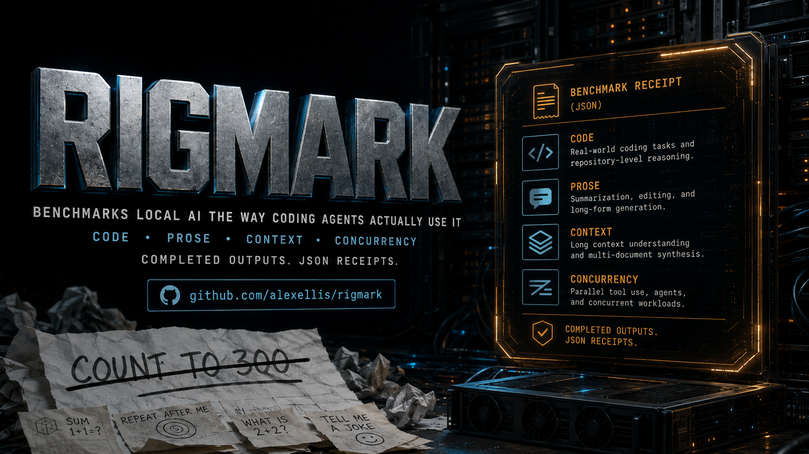

# RigMark



**RigMark benchmarks local AI the way coding agents actually use it.**

Most AI benchmarks reduce a serving stack to one flattering number. RigMark is
a reproducible stress test for the whole OpenAI-compatible appliance: completed
code and prose, an explicitly labelled structured-output ceiling, exact
cold/warm prefill, and concurrent agent behaviour.

It is deliberately model-agnostic: use it with Qwen, GLM, DeepSeek, vLLM,
SGLang, local GPU servers, or multi-node DGX Spark recipes. A different model or
serving stack is an appliance comparison; identical weights and software are
required before claiming a topology-only speed-up.

## One screenshot, one receipt

```text
╭──────────────────────────────────────────────────────────────────────────────────────────╮
│  R I G M A R K   //   AGENT WORKLOAD RECEIPT                                             │
│  BENCHMARKS LOCAL AI THE WAY CODING AGENTS ACTUALLY USE IT                               │
│  ●  15/15 OUTPUTS COMPLETE                                                               │
├─ SYSTEM ─────────────────────────────────────────────────────────────────────────────────┤
│  MODEL      Qwen3.8-27B-FP8-vllm                                                         │
│  APPLIANCE  1x NVIDIA RTX PRO 6000 Blackwell Workstation Edition, 96 GB                  │
│  RUN        reasoning=low  •  protocol=1.0.0                                             │
│  SOURCE     git:046e92cbe941  •  clean                                                   │
├─ REAL OUTPUT ────────────────────────────────────────────────────────────────────────────┤
│  WORKLOAD                 MEDIAN          OBSERVED RANGE          COMPLETE               │
│  CODE                 129.5 tok/s      124.0–130.4           ✓ 5/5                       │
│  PROSE                 84.2 tok/s       81.9–100.1           ✓ 5/5                       │
│  STRUCTURED*          136.0 tok/s      135.0–136.1           ✓ 5/5                       │
│  * predictable-output ceiling; not a proxy for agent speed                               │
├─ CONTEXT ────────────────────────────────────────────────────────────────────────────────┤
│  64K PREFILL   cold 5,808 tok/s  •  cached replay 85,248 tok/s                           │
├─ MULTI-AGENT LOAD ───────────────────────────────────────────────────────────────────────┤
│  SHORT CODE • END-TO-END • 256-TOKEN CAP PER AGENT                                       │
│  AGGREGATE   C1 108.7  •  C2 206.0  •  C4 385.4 tok/s                                    │
├─ PROOF ──────────────────────────────────────────────────────────────────────────────────┤
│  RECEIPT    sha256:604ea2c48107a69f…                                                     │
│  SHARE THE CARD • LINK THE JSON RECEIPT • #RIGMARK                                       │
│  github.com/alexellis/rigmark                                                            │
╰──────────────────────────────────────────────────────────────────────────────────────────╯
```

The card is the shareable headline. It always shows the benchmark Git revision
and whether that worktree was clean or dirty. GitHub source archives embed the
originating commit too, so downloading a tarball does not lose the benchmark
revision. The content-hashed
[result JSON](results/reference/qwen38-27b-fp8-rtxpro6000-low.json) is the
receipt: complete outputs, ranges, TTFT, settings, and appliance metadata.

## Run the standard suite

Python 3.10 or newer is required; there are no third-party packages.

```bash
git clone https://github.com/alexellis/rigmark
cd rigmark
./rigmark configure

./rigmark run \
  --base-url http://SERVER:8000 \
  --model auto \
  --label my-appliance \
  --comparison-id weekend-sweep-1 \
  --metadata metadata.json
```

The configurator explains every metadata field and writes the ignored local
`metadata.json`. See [`METADATA.md`](METADATA.md) if an agent is filling it in
for you. The benchmark refuses unchanged placeholders or missing required
fields. Use the same comparison ID for every appliance in one A/B sweep. This
makes every generated prompt byte-for-byte identical; use a new ID for the next
sweep. If the model supports graded effort or a thinking toggle, set it
explicitly with `--extra-body` and use the identical value throughout the
sweep; model defaults are not assumed equivalent.

The default suite performs:

- five runs of code, prose, and structured JSON with a 4,096-token ceiling;
- three cold/immediate-warm pairs at 8,192, 32,768, and 65,536 tokens; and
- three rounds of code at concurrency 1, 2, and 4 with 256-token outputs.

Results are written to `results/LABEL-TIMESTAMP.json`. Neither the endpoint URL
nor API credentials are written to the result. Credentials are read from
`OPENAI_API_KEY` by default; use `--api-key-env NAME` to select another
environment variable. Visible generated output is retained for auditability;
reasoning text is not retained, although its size and hash are recorded.
Every decode workload has a completion gate. Code and prose must emit a visible
answer without hitting the token ceiling; structured JSON must match every
requested value. Throughput from a failed gate remains diagnostic but must not
be cited as a successful workload result.

At the end, the runner prints a terminal result card designed to be
screenshotted and saves a stable `RESULT.card.txt` beside the JSON. Reprint or
regenerate it at any time with:

```bash
./rigmark report --save results/YOUR-RESULT.json
```

Share the card with the complete JSON—the card is the headline, and the JSON
is the receipt.

## Challenge a recipe

Run the standard suite unchanged against a quiet endpoint and publish its card
and JSON receipt. That is the whole challenge: completed code and prose,
structured output labelled as a ceiling, cold and warm prefill, and concurrent
service load under one disclosed protocol. A recipe may optimise anything on
the server side; RigMark keeps the client-side work and claim boundaries fixed.

There is deliberately no universal `thinking=off` profile. Some templates
implement that switch, some ignore it, and others expose different controls.
Publish such a run as a separately labelled, model-specific ceiling and compare
it only with receipts carrying the identical request body.

For an engine without vLLM's `/tokenize` extension or token-ID completion
input, add `--skip-prefill`. To omit load testing, add `--skip-concurrency`.

## Compare two results

```bash
./rigmark compare results/recipe-a.json results/recipe-b.json
```

For a matched, screenshot-ready A/B card:

```bash
./rigmark compare --card results/recipe-a.json results/recipe-b.json
```

The comparison stops when the protocol, prompt corpus, thinking/request body,
run counts, output lengths, prefill depths/runs, or concurrency settings differ.
`--allow-mismatch` exists for exploratory comparisons and prints the mismatches.

## Fair-use checklist

- Run against a quiet endpoint and disclose any competing traffic.
- Pin and publish model, drafter, engine/image, and benchmark revisions.
- Publish the complete result JSON and command, not only a screenshot.
- Check the retained outputs; throughput alone is not a quality score.
- Headline code and prose medians with their ranges—not a best run.
- Label structured output as a speculative-decoding ceiling.
- Report cold and warm prefill separately.
- Verify the negotiated fabric rate rather than copying a product headline.

The exact measurement definitions and claim boundaries are in
[`PROTOCOL.md`](PROTOCOL.md).

## Published reference runs

Reference results include their complete generated outputs and appliance
metadata, not just headline numbers. See [`RESULTS.md`](RESULTS.md) for the
current table and exact commands.

## Development

```bash
python3 -m unittest discover -s tests -v
python3 -m py_compile bench.py compare.py configure.py report.py rigmark
```

## Licence

MIT
