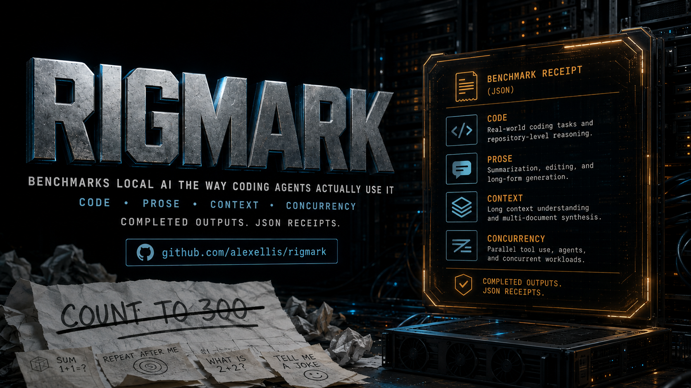

# RigMark



**RigMark benchmarks local AI how coding agents actually use it.**

Most AI benchmarks reduce a serving stack to one flattering number. RigMark is
a reproducible stress test for the whole OpenAI-compatible appliance:
agent-shaped code and prose, an explicitly labelled structured-output ceiling,
exact cache-busting/immediate-replay prefill, and concurrent request behaviour.
It is a serving benchmark, not a claim that three prompts reproduce a complete
multi-turn coding session.

It is deliberately model-agnostic: use it with Qwen, GLM, DeepSeek, vLLM,
SGLang, local GPU servers, or multi-node DGX Spark recipes. A different model or
serving stack is an appliance comparison; identical weights and software are
required before claiming a topology-only speed-up.

## One screenshot, one receipt

```text
╭────────────────────────────────────────────────────────────────────────╮
│  R I G M A R K   //   AGENT WORKLOAD RECEIPT                           │
│  BENCHMARKS LOCAL AI HOW CODING AGENTS ACTUALLY USE IT                 │
│  ●  15/15 BASIC OUTPUT GATES PASSED                                    │
├─ MODEL ────────────────────────────────────────────────────────────────┤
│  Qwen3.8-27B-FP8-vllm                                                  │
├─ SINGLE STREAM ────────────────────────────────────────────────────────┤
│  WORKLOAD         tok/s       Range tok/s   Last (s)    Checks         │
│  CODE             129.5       124.0–130.4       25.2     ✓ 5/5         │
│  PROSE             84.2        81.9–100.1       19.9     ✓ 5/5         │
│  STRUCTURED*      136.0       135.0–136.1        7.9     ✓ 5/5         │
│  * Predictable JSON ceiling; not general agent performance.            │
│  Decode medians are estimates; rates include streamed reasoning.       │
├─ PREFILL ──────────────────────────────────────────────────────────────┤
│  DEPTH      First tok/s     First TTFT (s)    Replay TTFT (s)          │
│  8K               8,173               1.00               0.25          │
│  32K              6,968               4.70               0.44          │
│  64K              5,808              11.28               0.77          │
│  Cold cache UNVERIFIED: cache-hit usage unavailable.                   │
│  Medians; replay is an immediate repeat, not a proven hit.             │
├─ CAPPED CONCURRENT GENERATION ─────────────────────────────────────────┤
│  Aggregate tok/s: C1 108.7 | C2 206.0 | C4 385.4                       │
│  C4: 0/12 normal stops; 2/12 with visible output.                      │
│  Capped throughput includes reasoning; not completed agent tasks.      │
├─ APPLIANCE ────────────────────────────────────────────────────────────┤
│  Hardware: 1x NVIDIA RTX PRO 6000 Blackwell Workstation Edition, 96 GB │
│  Topology: TP1, local PCIe GPU                                         │
│  Checkpoint: Qwen/Qwen3.8-27B-FP8 @ local checkp                       │
│  Quantisation: FP8 E4M3, dynamic activations, 128x128 blocks           │
│  KV cache: FP8                                                         │
│  Engine: vLLM 0.27.1                                                   │
├─ SETTINGS ─────────────────────────────────────────────────────────────┤
│  SUITE: DEFAULT SETTINGS                                               │
│  REQUEST: {"chat_template_kwargs": {"reasoning_effort": "low"}}        │
│  Temperature 0.0 | top_p 1.0 | seed 20260905 | protocol 1.0.0          │
│  Decode: 5 runs, 4096-token cap | Prefill: 8K/32K/64K, 3 pairs         │
│  Concurrency: C1/C2/C4, 3 rounds, 256-token cap; workload code         │
│  Comparison ID: 2026-09-05-rigmark-standard-v2                         │
├─ RECEIPT ──────────────────────────────────────────────────────────────┤
│  SOURCE     git:046e92cbe941  •  clean                                 │
│  JSON sha256:604ea2c48107a69f…                                         │
│  SHARE THE CARD • LINK THE JSON RECEIPT • #RIGMARK                     │
│  github.com/alexellis/rigmark                                          │
╰────────────────────────────────────────────────────────────────────────╯
```

This card is rendered from a published protocol 1.0 receipt. The current runner
emits protocol 1.2 receipts with per-pair cache isolation and cache-usage
evidence. This older receipt has no cache-hit evidence, so its prefill is
explicitly labelled unverified by the current renderer.

The card is the shareable headline. It always shows the benchmark Git revision
and whether that worktree was clean or dirty. GitHub source archives embed the
originating commit too, so downloading a tarball does not lose the benchmark
revision. The content-hashed
[result JSON](results/reference/qwen38-27b-fp8-rtxpro6000-low.json) is the
receipt: complete outputs, ranges, TTFT, settings, and appliance metadata.
The checksum identifies those exact bytes; it is not a signature or independent
attestation. A linked Git commit or release supplies the public anchor.

## Run the standard suite

Python 3.10 or newer is required; there are no third-party packages.

```bash
git clone https://github.com/alexellis/rigmark
cd rigmark
./rigmark configure

./rigmark run \
  --base-url http://SERVER:8000 \
  --model auto \
  --label my-appliance \
  --comparison-id weekend-sweep-1 \
  --metadata metadata.json
```

The configurator explains every metadata field and writes the ignored local
`metadata.json`. See [`METADATA.md`](METADATA.md) if an agent is filling it in
for you. The benchmark refuses unchanged placeholders or missing required
fields. Use the same comparison ID for every appliance in one A/B sweep. This
makes the corresponding generated prompts byte-for-byte identical. Keep the ID
when repeating the same inputs; changing it changes the prompt nonces. Fresh
per-pair cache salts isolate prefill independently of that ID. If the model supports graded effort or a thinking toggle, set it
explicitly with `--extra-body` and use the identical value throughout the
sweep; model defaults are not assumed equivalent.

The repository also includes clearly labelled
[first-party serving records](examples/serving-records/) for the Qwen 27B,
Qwen Flash Next, DeepSeek V4 Flash 0731, and GLM-5.3-Flash appliances operated
by Alex Ellis. These are
versioned metadata inputs, not benchmark results or defaults for other users.
They pin details that are easy to misreport—especially the drafter, image,
recipe revision, scheduler, context limit, and co-resident services. Copy one
only when reproducing that appliance, then change every field that differs.

The default suite performs:

- five runs of code, prose, and structured JSON with a 4,096-token ceiling;
- three cold/immediate-warm pairs at 8,192, 32,768, and 65,536 tokens; and
- three rounds of code at concurrency 1, 2, and 4 with 256-token outputs.

The concurrency phase is deliberately a capped generation-capacity test. It
reports normal-stop and visible-output counts and must not be described as
completed multi-agent coding work; reasoning models may spend the entire cap on
reasoning.

Results are written to `results/LABEL-TIMESTAMP.json`. Neither the endpoint URL
nor API credentials are written to the result. Credentials are read from
`OPENAI_API_KEY` by default; use `--api-key-env NAME` to select another
environment variable. Visible generated output is retained for auditability;
reasoning text is not retained, although its size and hash are recorded.
Every decode workload has a basic output gate. Code and prose must emit a
visible answer and finish normally; structured JSON must additionally match
every requested value. This is not a code-correctness score. Throughput from a
failed gate remains diagnostic but must not be cited as a successful workload
result. RigMark also reports time to the last generated output, because tok/s
alone can conceal how long a verbose or reasoning-heavy answer takes.

The card retains medians and min/max ranges. Protocol 1.2 JSON also includes
`pooled_decode_tokens_per_second`, calculated from summed decode-token
numerators and decode windows. It supplements the median; longer answers carry
more weight. Neither ranges nor pooled rates are confidence intervals.

Prefill sends a fresh `cache_salt` for every cold/replay pair. Known cache hits
on a cold sample fail the run. If the server omits cache usage, the card marks
that measurement unverified. Skipped phases remain visible as an incomplete
suite. Custom suite flags and the full extra request body appear below the
results, alongside wrapped appliance details.

At the end, the runner prints a terminal result card designed to be
screenshotted and saves a stable `RESULT.card.txt` beside the JSON. Reprint or
regenerate it at any time with:

```bash
./rigmark report --save results/YOUR-RESULT.json
```

Share the card with the complete JSON—the card is the headline, and the JSON
is the receipt.

The code answer deliberately includes an implementation and its own test suite.
Replay those model-supplied tests in a locked-down Docker container with:

```bash
docker pull golang:1.25
./rigmark audit-code results/YOUR-RESULT.json
```

Generated code is untrusted. The command disables networking, drops
capabilities, makes the container root filesystem and source mount read-only,
and applies CPU, memory, and process limits. A disposable VM remains the
stronger isolation boundary. Passing model-written tests is useful evidence of
self-consistency, not proof of correctness.

## Challenge a recipe

Run the standard suite unchanged against a quiet endpoint and publish its card
and JSON receipt. That is the whole challenge: agent-shaped code and prose,
structured output labelled as a ceiling, cache-busting and immediate-replay
prefill, and concurrent service load under one disclosed protocol. A recipe may
optimise anything on the server side; RigMark keeps the client-side work and
claim boundaries fixed.

There is deliberately no universal `thinking=off` profile. Some templates
implement that switch, some ignore it, and others expose different controls.
Publish such a run as a separately labelled, model-specific ceiling and compare
it only with receipts carrying the identical request body.

For an engine without vLLM's `/tokenize` extension or token-ID completion
input, add `--skip-prefill`. To omit load testing, add `--skip-concurrency`.

## Compare two results

```bash
./rigmark compare results/recipe-a.json results/recipe-b.json
```

For a matched, screenshot-ready A/B card:

```bash
./rigmark compare --card results/recipe-a.json results/recipe-b.json
```

The comparison validates raw rows against reported summaries and gates, then
stops when the benchmark revision, protocol, prompt corpus, seed,
thinking/request body, run counts, output lengths, prefill depths/runs, or
concurrency settings differ. `--allow-mismatch` exists for exploratory
comparisons and prints the mismatches. A matched card means the client requests
match; token/s ratios still require matching server-side token definitions.

## Fair-use checklist

- Run against a quiet endpoint and disclose any competing traffic.
- Pin and publish model, drafter, engine/image, and benchmark revisions.
- Publish the complete result JSON and command, not only a screenshot.
- Check the retained outputs and code-test audit; throughput alone is not a
  quality score.
- Headline code and prose medians with their ranges—not a best run.
- Label structured output as a speculative-decoding ceiling.
- Report cache-busting and immediate-replay prefill separately.
- Verify the negotiated fabric rate rather than copying a product headline.

The exact measurement definitions and claim boundaries are in
[`PROTOCOL.md`](PROTOCOL.md).

## Published reference runs

Reference results include their complete generated outputs and appliance
metadata, not just headline numbers. See [`RESULTS.md`](RESULTS.md) for the
current table and exact commands.

## Development

```bash
python3 -m unittest discover -s tests -v
python3 -m py_compile audit_code.py bench.py compare.py configure.py receipt.py report.py rigmark
```

## Licence

MIT
